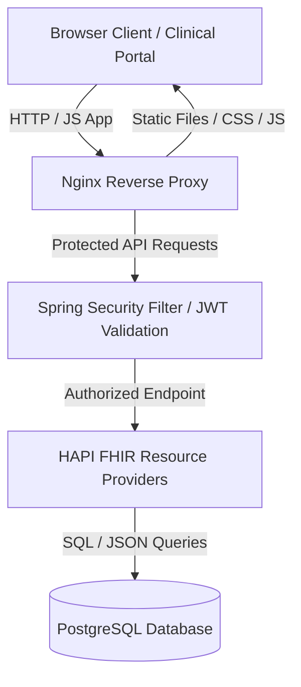

<div align="center">

# 🌊 FHIRStorm

### **Patient Medical Records Management System**

*An enterprise-ready, containerized full-stack medical records platform strictly conforming to the HL7 FHIR R4 standard.*

[](https://hl7.org/fhir/R4/)
[](file:///Users/chrisfegela/git/cfeg/fhirstorm/backend)
[](file:///Users/chrisfegela/git/cfeg/fhirstorm/frontend)
[](file:///Users/chrisfegela/git/cfeg/fhirstorm/init-db.sql)
[](file:///Users/chrisfegela/git/cfeg/fhirstorm/docker-compose.yml)

</div>

---

## 📖 Overview

FHIRStorm is designed to serve as a reference implementation for managing clinical data using the **HL7 FHIR R4** standard. The system is built with a highly responsive, modern clinical dashboard (inspired by the application's clean Navy and Sky Blue design system) connected to a robust Java backend powered by the industry-standard HAPI FHIR library.

### Key Capabilities
- **Strict FHIR Compliance:** Native parsing, validation, and storage of FHIR R4 resources.
- **Role-Based Access Control:** Secure JWT token authentication safeguarding practitioner, patient, and administrator operations.
- **Clinical Dashboard:** A modern, clean navy-accented frontend featuring dynamic charts, vitals monitoring, and an interactive FHIR JSON inspector.
- **Instant Hot-Reloading:** The static assets are bind-mounted directly to Nginx, enabling local developments to compile instantly.

---

## 📐 System Architecture



---

## 🏗️ Technology Stack

| Layer | Component | Description & Entrypoint |
| :--- | :--- | :--- |
| **Frontend** | Vanilla JS (ES6+), HTML5, CSS3 | Navy-dark and sky-blue styling system. [frontend/css/styles.css](file:///Users/chrisfegela/git/cfeg/fhirstorm/frontend/css/styles.css) & [frontend/index.html](file:///Users/chrisfegela/git/cfeg/fhirstorm/frontend/index.html) |
| **Backend API** | Java 17, Spring Boot, HAPI FHIR R4 | Production-grade FHIR resource handler. [backend/](file:///Users/chrisfegela/git/cfeg/fhirstorm/backend) (Main application: [FhirstormApplication.java](file:///Users/chrisfegela/git/cfeg/fhirstorm/backend/src/main/java/com/fhirstorm/FhirstormApplication.java)) |
| **Database** | PostgreSQL 15 | Persistent SQL tables serving FHIR schema. Configured via [init-db.sql](file:///Users/chrisfegela/git/cfeg/fhirstorm/init-db.sql) |
| **Orchestration** | Podman / Docker Compose | Single-command multi-service orchestration. [docker-compose.yml](file:///Users/chrisfegela/git/cfeg/fhirstorm/docker-compose.yml) |

---

## 🚀 Quick Start (Docker Compose)

Get the complete application stack running locally in seconds:

```bash
# 1. Start all containers in background mode
docker compose up -d --build

# 2. Monitor real-time logs for the Spring Boot backend
docker logs fhirstorm-backend -f

# 3. Stop and clean up container resources
docker compose down
```

> [!TIP]
> The `./frontend` directory is mounted live into the Nginx container as a read-only volume (`:ro`). Any updates made to HTML, CSS, or JS files will show up immediately in your browser upon refresh (`F5` / `Cmd` + `R`).

Once the orchestrator is up, open your browser and navigate to **[http://localhost](http://localhost)**.

---

## 🔐 Preset Accounts & JWT Authentication

All requests accessing FHIR APIs must include a signed JWT Bearer Token. Default roles are pre-seeded in the database:

| Role | Username / Email | Password | Permissions |
| :--- | :--- | :--- | :--- |
| **Practitioner (Doctor)** | `doctor@fhirstorm.org` | `doctor123` | Read/Write Patient records, Record Vitals & Prescriptions |

### Example JWT Authenticated Request

To login and receive your token, call the Auth controller API:

```bash
curl -X POST http://localhost/api/auth/login \
  -H "Content-Type: application/json" \
  -d '{"username":"doctor@fhirstorm.org","password":"doctor123"}'
```

---

## 🩺 Supported FHIR R4 Resources & Operations

FHIRStorm provides complete CRUD RESTful endpoints adhering to HL7 FHIR specification:

| Endpoint | Method | Description |
| :--- | :--- | :--- |
| `/fhir/Patient` | `GET` | Query all patients or search by name (`?name=Doe`) |
| `/fhir/Patient/{id}` | `GET` | Read patient resource by ID |
| `/fhir/Patient` | `POST` | Create a new FHIR Patient resource |
| `/fhir/Patient/{id}` | `PUT` | Update an existing FHIR Patient resource |
| `/fhir/Patient/{id}` | `DELETE` | Delete a FHIR Patient resource |
| `/fhir/Observation` | `GET`, `POST`, `PUT`, `DELETE` | CRUD operations for vital sign Observations |
| `/fhir/Condition` | `GET`, `POST`, `PUT`, `DELETE` | CRUD operations for diagnoses & SNOMED conditions |
| `/fhir/MedicationRequest` | `GET`, `POST`, `PUT`, `DELETE` | CRUD operations for RxNorm active prescriptions |
| `/fhir/Encounter` | `GET`, `POST`, `PUT`, `DELETE` | CRUD operations for clinical encounters |
| `/fhir/metadata` | `GET` | Fetch server CapabilityStatement |

---

## 📁 Repository Structure

```
fhirstorm/
├── backend/
│   ├── src/main/java/com/fhirstorm/
│   │   ├── FhirstormApplication.java
│   │   ├── config/ (FhirServerConfig, SecurityConfig, DataInitializer)
│   │   ├── providers/ (Patient, Observation, Condition, Encounter, MedicationRequest)
│   │   ├── model/ & repository/ (PostgreSQL FHIR entities)
│   │   └── security/ (JWT Auth Controller & Security Filters)
│   ├── pom.xml
│   └── Dockerfile (Multi-stage build)
├── frontend/
│   ├── index.html
│   ├── css/styles.css (Clean Light & Navy Blue design system)
│   ├── js/ (app.js, api.js, auth.js)
│   ├── nginx.conf (Static server & API reverse proxy)
│   └── Dockerfile
├── docker-compose.yml
├── init-db.sql
└── README.md
```
